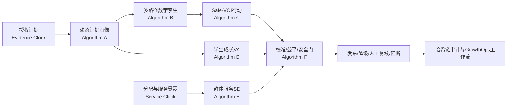

# T³-C² Path GrowthOps / 路径增值引擎

[](https://github.com/Ring0321/T3C2-Path-GrowthOps/actions/workflows/ci.yml)
[](https://www.python.org/)
[](LICENSE)
[](DATA_CARD.md)

T³-C² Path GrowthOps 是一个面向大学生全周期成长规划的开源研究型算法与智能体工程。它不预测“唯一未来”，也不把一次测评包装成稳定人格标签；它把证据、路径、行动、评价与人工复核组织为可追溯闭环。

> 当前版本是可复现的研发基线。仓库中的样本全部为合成数据；任何数值均不能被解释为真实学生效果、华图服务效果或商业收益。

## 为什么不是另一个推荐器

- **T³ 三时钟**：分别管理证据时效、路径时间窗和服务暴露时间，防止过期证据、失效规则与逆向因果混在一个“更新时间”里。
- **C² 双反事实**：把学生相对自身起点的成长增值 `VA` 与指定服务策略的群体效益 `SE` 分开，禁止用“学生进步了”证明“企业服务导致进步”。
- **Path 时序数字孪生**：把主路径、辅路径和备选路径建成带依赖、硬时窗、可迁移资产、切换与回退历史的状态机；适配度与准备度分开记录。
- **Path 安全行动实验**：以 Safe-VOI 选择低成本、可退出、能产生新信息的下一步行动；安全门不可被高分抵消。
- **选择性发布**：证据不足、规则过期、无授权、群体风险或高利害场景触发降级、拒答或人工会商。

## 研发路线

1. 固定数据契约、研究边界与可证伪条件。
2. 实现证据状态、多路径数字孪生和 Safe-VOI。
3. 实现 VA、SE、校准、公平与安全发布门。
4. 通过多智能体编排、审计日志、CLI 和 REST API 形成可运行闭环。
5. 用合成真值、红队样本和 CI 验证计算性质，再进入真实伦理审批后的试点。

## 可执行架构



核心包保持 `domain <- algorithms <- agents <- application <- api/cli` 的单向依赖。算法是可单测的纯计算；智能体是最小权限边界；API 只是适配器。

详细规格见 [SPEC.md](SPEC.md)，科研边界见 [docs/RESEARCH_BOUNDARIES.md](docs/RESEARCH_BOUNDARIES.md)，架构决策见 [docs/ARCHITECTURE.md](docs/ARCHITECTURE.md)。

## 快速开始

```bash
python -m venv .venv
python -m pip install -e ".[dev,api,research]"
pytest
t3c2-path demo
uvicorn t3c2_path.api:app --reload
```

固定合成演示：

```bash
python -m t3c2_path demo --output outputs/demo-result.json
python scripts/export_validation_bundle.py
```

已知真值队列固定种子为 `20260719`，1200 条合成记录中真实 ATE 为 `2.995`，朴素组间差为 `7.294`，AIPW 为 `2.600`，95% 区间 `[2.096, 3.104]`。这验证了在生成器假设和已知 nuisance 值下，代码能够识别明显选择偏差；它不证明真实服务有效。完整结果与文件哈希见 [research/generated/validation_report.json](research/generated/validation_report.json) 和 [research/generated/manifest.json](research/generated/manifest.json)。

提交材料中的 Word/Excel 另含 `document-design-fixture/1.0.0` 五折交叉拟合演练。它与仓库的 `open-source-reference/0.2.0` 使用不同的数据生成过程，因此数值不作横向比较；二者的角色、哈希、允许与禁止解释均冻结在 [research/submission_release_manifest.json](research/submission_release_manifest.json)。R01—R12 红队状态由可执行测试导出，不接受手工把“待执行”改成“通过”。

## 接口

- `GET /health`：运行状态与 `synthetic_only` 边界。
- `POST /v1/decisions/evaluate`：不可变决策事务，输出画像、路径、任务、门控、解释、版本与审计记录。
- 所有未知字段均拒绝；验证错误统一为 `error.code/message/details`。
- 参考 API 没有生产认证或持久化，禁止直接接入真实学生数据或暴露到公网。

## 证据与治理文件

- [算法卡](docs/ALGORITHM_CARDS.md)：六模块公式、验收、证伪和降级规则。
- [多智能体协议](docs/AGENT_PROTOCOL.md)：权限矩阵、事务顺序和冲突解决。
- [验证协议](docs/VALIDATION_PROTOCOL.md)：合成真值、基准、红队和未来试点。
- [主张登记册](docs/CLAIM_REGISTER.md)：12 项主张的成熟度、允许与禁止表述。
- [研发路线图](docs/ROADMAP.md)：从研究基线到原型、等待组试点和多校验证的退出标准。
- [模型卡](MODEL_CARD.md)、[数据卡](DATA_CARD.md) 与 [威胁模型](docs/THREAT_MODEL.md)。

## 许可与责任

代码采用 Apache-2.0。教育建议、职业选择和服务效果评价均有现实风险；部署者必须取得合法授权、进行本地化规则核验、完成公平与安全审计，并保留人工复核。详见 [SECURITY.md](SECURITY.md)。
