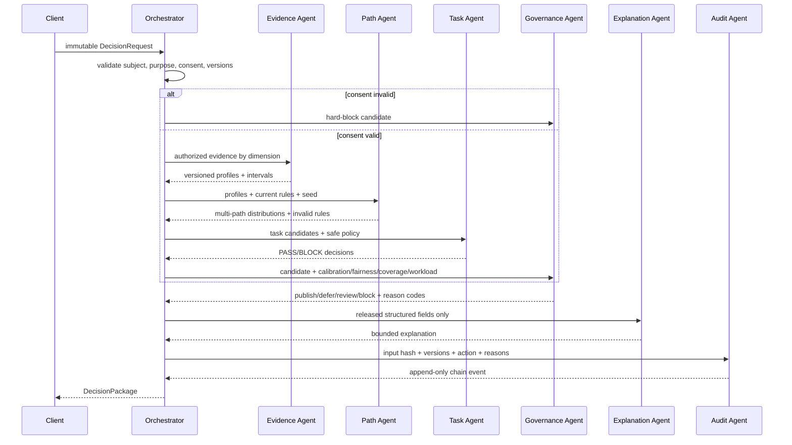

# Multi-agent protocol and decision transaction

## 1. Why these are agents

The project does not call a set of differently worded prompts a multi-agent system. An agent is a named authority boundary with a typed input, typed output and a minimal capability set. The reference implementation is deterministic; a future language model may draft explanations only after structured computation and may not receive write permission for profiles, paths, causal reports or gates.

## 2. Capability matrix

| Agent | Reads | May write | Explicitly cannot write |
|---|---|---|---|
| Evidence agent | authorized `EvidenceRecord` | versioned `ProfileSnapshot` | path, task, service effect, explanation |
| Path agent | profiles, versioned `KnowledgeRule` | path simulations | evidence, consent, gate |
| Task agent | paths, candidate task contract, rules | gated task ranking | profile, service effect, final publication |
| Governance agent | structured outputs and diagnostics | `GateResult`, review reason | underlying score or evidence |
| Explanation agent | released structured package | bounded natural-language explanation | any number, rule, action or claim level |
| Audit agent | hashes and version IDs | append-only audit event | previous event or business outcome |

Every write is preceded by `AgentContract.require(capability)`. A permission violation raises an exception and becomes a permanent regression test.

## 3. Decision transaction



## 4. Conflict order

1. Lawful purpose, withdrawal and consent override all other outputs.
2. Current hard rules override model preference and path score.
3. Safety, fairness and high-stakes restrictions override business priority.
4. Structured calculations override generated explanations.
5. Qualified human review may override a recommendation only with a reason code; the original and override remain auditable.

## 5. API contract

`POST /v1/decisions/evaluate` accepts a complete immutable transaction. The API rejects unknown fields and returns camelCase JSON. Validation errors use one shape:

```json
{
  "error": {
    "code": "VALIDATION_ERROR",
    "message": "Invalid request",
    "details": []
  }
}
```

The reference API intentionally has no authentication or durable database and is synthetic-only. It is an executable contract, not a production deployment. Production integration requires identity, tenant isolation, purpose-bound authorization, rate limiting, encryption, retention and incident response.

## 6. Explanation consistency rule

The deterministic explanation always names the gate action, number of non-dominated paths, next reversible task, uncertainty and prohibited interpretations. If a language model is introduced later, its output must be scanned against the structured package: numbers, path IDs, action, claim level and blocked commercial tasks must match exactly. A mismatch falls back to the deterministic template.
