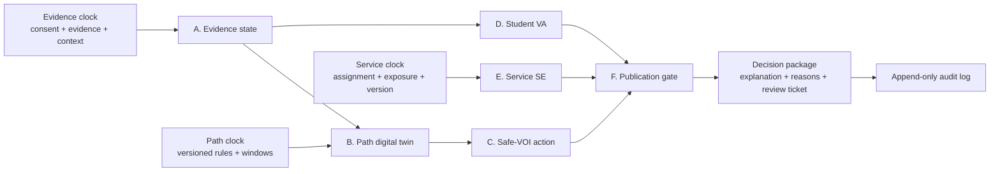

# Architecture

## 1. One transaction, six bounded computations

T³ 是三套时间语义，不是三个普通字段。C² 是两个不同估计对象，不能互相替换。F 门控发生在解释生成和业务触达之前。

## 2. Dependency direction

`domain <- algorithms <- agents <- application <- api/cli`

领域模型不依赖 FastAPI、数据库或大模型。算法保持纯函数，便于合成真值与反事实测试。智能体是具名的能力边界，不等于多个提示词；编排器检查权限并记录每一步输入输出。API 和 CLI 只是适配器。

## 3. Safety invariants

1. `fact != inference`：原始证据与状态推断分层保存。
2. `unknown != zero`：缺失不进入负向评分。
3. `VA != SE`：学生成长报告与服务效果报告使用不同类型。
4. `hard gate > soft score`：安全、授权和规则有效期不可被价值分抵消。
5. `high stakes -> human`：高利害用途不能自动发布。
6. `versioned or invalid`：不能复现知识、模型和输入版本的决策视为无效。

## 4. Initial deployment boundary

v0.1.0 是单进程、无状态参考实现。生产化需要经单独威胁建模后增加身份、授权、加密存储、租户隔离、速率限制、可观测性和灾难恢复；不得把演示 API 直接暴露到公网。

